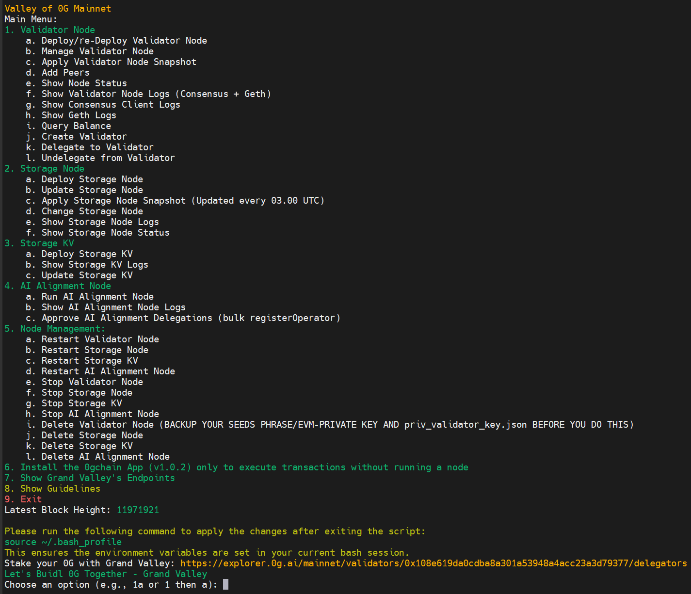

## Valley of 0G: Tools by Grand Valley




**Valley of 0G** by Grand Valley is an all-in-one solution for managing nodes within the 0G decentralized AI network. It provides easy tools to deploy, monitor, and maintain validator node storage node and AI alignment node making it simple to manage AI-focused infrastructure. Designed for scalability and performance, Valley of 0G helps efficiently manage data and resources, all within a community-driven environment with public support and endpoints.

### Key Features of Valley of 0G

- Unified Node Control: Deploy, update, snapshot, and manage Validator, Storage, Storage KV, and AI Alignment from one menu.
- Validator Operations: Create validator, add peers, query balance, delegate/undelegate, and view combined or per-client logs.
- Storage Node Suite: Install/update, apply official snapshots, change config (RPC/miner key), view status and logs; aligned with latest Flow/Mine/Reward contracts.
- Storage KV Services: Deploy/update KV, connect to storage nodes, follow the Flow log contract, and tail KV logs.
- Lifecycle & Safety Tools: Restart/stop/delete for each service with confirmations and clear guidance.
- Built-in Endpoints & Health: Quick access to Grand Valley public endpoints and status checks.
- Guided UX: Interactive prompts, shortcuts like "1a", and integrated Guidelines help screen.
- Mainnet Ready: Aristotle chain support; validator v1.0.2, storage v1.1.0, storage‑kv v1.4.0.

---

## Installation

#### System Requirements

| Category   | Requirements                  |
| ---------- | ---------------------------- |
| CPU        | 8 cores                      |
| RAM        | 64+ GB                       |
| Storage    | 1+ TB NVMe SSD               |
| Bandwidth  | 100 MBps for Download/Upload |

- Guide's current binaries version: `v1.0.2` (will automatically update to the latest version)
- Service file name: `0gchaind.service`

### Automatic Installation

Run the following command to install Valley of 0G:

```bash
bash <(curl -s https://raw.githubusercontent.com/hubofvalley/Mainnet-Guides/main/0g%20\(zero-gravity\)/resources/valleyof0G.sh)
```

This loader script (stored in this repo) fetches and runs the primary installer hosted in the dedicated Valley-of-0G-Mainnet repository: https://github.com/hubofvalley/Valley-of-0G-Mainnet/.

- Install the 0G app for command-line transactions and network interactions without running a full node.

---

## Manual Installation (Aristotle Validator Node)

> **Warning:** This process will remove any previous 0gchaind/0g-geth installation and data on your server.

### 1. Cleanup Previous Installations

```bash
sudo systemctl stop 0gchaind 0g-geth 0ggeth
sudo systemctl disable 0gchaind 0g-geth 0ggeth
sudo rm -f /etc/systemd/system/0gchaind.service /etc/systemd/system/0g-geth.service /etc/systemd/system/0ggeth.service
sudo rm -f $HOME/go/bin/0gchaind $HOME/go/bin/0g-geth $HOME/go/bin/0ggeth
rm -rf $HOME/.0gchaind $HOME/aristotle $HOME/aristotle-v1.0.2 $HOME/aristotle-v1.0.2.tar.gz
```

### 2. Install Dependencies

```bash
sudo apt update && sudo apt upgrade -y
sudo apt install curl git wget htop tmux build-essential jq make lz4 gcc unzip -y
```

### 3. Install Go

```bash
cd $HOME && ver="1.22.5"
wget "https://golang.org/dl/go$ver.linux-amd64.tar.gz"
sudo rm -rf /usr/local/go && sudo tar -C /usr/local -xzf "go$ver.linux-amd64.tar.gz"
rm "go$ver.linux-amd64.tar.gz"
echo 'export PATH=$PATH:/usr/local/go/bin:$HOME/go/bin' >> ~/.bash_profile
source ~/.bash_profile
[ ! -d ~/go/bin ] && mkdir -p ~/go/bin
go version
```

### 4. Download and Extract Aristotle Binary

```bash
cd $HOME
wget https://github.com/0gfoundation/0gchain-Aristotle/releases/download/1.0.2/aristotle-v1.0.2.tar.gz
tar -xzvf aristotle-v1.0.2.tar.gz
mv aristotle-v1.0.2 aristotle
rm aristotle-v1.0.2.tar.gz
sudo chmod +x $HOME/aristotle/bin/geth
sudo chmod +x $HOME/aristotle/bin/0gchaind
```

### 5. Initialize Node

```bash
# Input your moniker, ports, and validator-specific settings
read -p "Enter your moniker: " MONIKER
read -p "Enter your preferred port number (default: 26): " OG_PORT
if [ -z "$OG_PORT" ]; then
    OG_PORT=26
fi
read -p "Do you want to enable the indexer? (yes/no): " ENABLE_INDEXER

# Validator-specific: mainnet ETH RPC and logs block range
read -p "Enter Mainnet ETH RPC endpoint (ETH_RPC_URL): " ETH_RPC_URL
while [ -z "$ETH_RPC_URL" ]; do
  echo "ETH_RPC_URL cannot be empty for validator mode."
  read -p "Enter Mainnet ETH RPC endpoint (ETH_RPC_URL): " ETH_RPC_URL
done
read -p "Enter block range to fetch logs (BLOCK_NUM), e.g. 2000: " BLOCK_NUM
while ! [[ "$BLOCK_NUM" =~ ^[0-9]+$ ]]; do
  echo "BLOCK_NUM must be a positive integer."
  read -p "Enter block range to fetch logs (BLOCK_NUM), e.g. 2000: " BLOCK_NUM
done

# Save environment variables
echo "export MONIKER=\"$MONIKER\"" >> ~/.bash_profile
echo "export OG_PORT=\"$OG_PORT\"" >> ~/.bash_profile
echo "export ETH_RPC_URL=\"$ETH_RPC_URL\"" >> ~/.bash_profile
echo "export BLOCK_NUM=\"$BLOCK_NUM\"" >> ~/.bash_profile
echo 'export PATH=$PATH:$HOME/aristotle/bin' >> ~/.bash_profile
source ~/.bash_profile

# Initialize chain
mkdir -p $HOME/.0gchaind/
cp -r $HOME/aristotle/* $HOME/.0gchaind/
0g-geth init --datadir $HOME/.0gchaind/0g-home/geth-home $HOME/.0gchaind/geth-genesis.json
0gchaind init "$MONIKER" --home $HOME/.0gchaind/tmp --chaincfg.chain-spec mainnet
```

### 6. Move Binaries to $HOME/go/bin/

```bash
cp $HOME/aristotle/bin/geth $HOME/go/bin/0g-geth
cp $HOME/aristotle/bin/0gchaind $HOME/go/bin/0gchaind
```

### 7. Patch Configuration Files

```bash
CONFIG="$HOME/.0gchaind/0g-home/0gchaind-home/config"
GCONFIG="$HOME/.0gchaind/geth-config.toml"

# config.toml
sed -i "s/^moniker *=.*/moniker = \"$MONIKER\"/" $CONFIG/config.toml
sed -i "s|laddr = \"tcp://0.0.0.0:26656\"|laddr = \"tcp://0.0.0.0:${OG_PORT}656\"|" $CONFIG/config.toml
sed -i "s|laddr = \"tcp://127.0.0.1:26657\"|laddr = \"tcp://127.0.0.1:${OG_PORT}657\"|" $CONFIG/config.toml
sed -i "s|^proxy_app = .*|proxy_app = \"tcp://127.0.0.1:${OG_PORT}658\"|" $CONFIG/config.toml
sed -i "s|^pprof_laddr = .*|pprof_laddr = \"0.0.0.0:${OG_PORT}060\"|" $CONFIG/config.toml
sed -i "s|prometheus_listen_addr = \".*\"|prometheus_listen_addr = \"0.0.0.0:${OG_PORT}660\"|" $CONFIG/config.toml

# Configure indexer based on user input
if [ "$ENABLE_INDEXER" = "yes" ]; then
    sed -i -e 's/^indexer = "null"/indexer = "kv"/' $CONFIG/config.toml
    echo "Indexer enabled."
else
    sed -i -e 's/^indexer = "kv"/indexer = "null"/' $CONFIG/config.toml
    echo "Indexer disabled."
fi

# app.toml
sed -i "s|address = \".*:3500\"|address = \"127.0.0.1:${OG_PORT}500\"|" $CONFIG/app.toml
sed -i "s|^rpc-dial-url *=.*|rpc-dial-url = \"http://localhost:${OG_PORT}551\"|" $CONFIG/app.toml
sed -i "s/^pruning *=.*/pruning = \"custom\"/" $CONFIG/app.toml
sed -i "s/^pruning-keep-recent *=.*/pruning-keep-recent = \"100\"/" $CONFIG/app.toml
sed -i "s/^pruning-interval *=.*/pruning-interval = \"19\"/" $CONFIG/app.toml

# geth-config.toml
sed -i "s/HTTPPort = .*/HTTPPort = ${OG_PORT}545/" $GCONFIG
sed -i "s/WSPort = .*/WSPort = ${OG_PORT}546/" $GCONFIG
sed -i "s/AuthPort = .*/AuthPort = ${OG_PORT}551/" $GCONFIG
sed -i "s/ListenAddr = .*/ListenAddr = \":${OG_PORT}303\"/" $GCONFIG
sed -i "s/DiscAddr = .*/DiscAddr = \":${OG_PORT}303\"/" $GCONFIG
sed -i "s/^# *Port = .*/# Port = ${OG_PORT}901/" $GCONFIG
sed -i "s/^# *InfluxDBEndpoint = .*/# InfluxDBEndpoint = \"http:\/\/localhost:${OG_PORT}086\"/" $GCONFIG
```

### 8. Copy Node Keys

```bash
cp $HOME/.0gchaind/tmp/data/priv_validator_state.json $HOME/.0gchaind/0g-home/0gchaind-home/data/
cp $HOME/.0gchaind/tmp/config/node_key.json $HOME/.0gchaind/0g-home/0gchaind-home/config/
cp $HOME/.0gchaind/tmp/config/priv_validator_key.json $HOME/.0gchaind/0g-home/0gchaind-home/config/
```

### 9. Generate JWT Authentication Token

```bash
0gchaind jwt generate --home $HOME/.0gchaind/0g-home/0gchaind-home --chaincfg.chain-spec mainnet
cp -f $HOME/.0gchaind/0g-home/0gchaind-home/config/jwt.hex $HOME/.0gchaind/jwt.hex
```

### 10. Create systemd Service Files

#### 0gchaind Service

```bash
sudo tee /etc/systemd/system/0gchaind.service > /dev/null <<EOF
[Unit]
Description=0gchaind Node Service (Validator)
After=network-online.target

[Service]
User=$USER
Environment=CHAIN_SPEC=mainnet
WorkingDirectory=$HOME/.0gchaind
ExecStart=$HOME/go/bin/0gchaind start \\
  --chaincfg.chain-spec mainnet \\
  --chaincfg.restaking.enabled \\
  --chaincfg.restaking.symbiotic-rpc-dial-url ${ETH_RPC_URL} \\
  --chaincfg.restaking.symbiotic-get-logs-block-range ${BLOCK_NUM} \\
  --home $HOME/.0gchaind/0g-home/0gchaind-home \\
  --chaincfg.kzg.trusted-setup-path=$HOME/.0gchaind/kzg-trusted-setup.json \\
  --chaincfg.engine.jwt-secret-path=$HOME/.0gchaind/jwt.hex \\
  --chaincfg.kzg.implementation=crate-crypto/go-kzg-4844 \\
  --chaincfg.engine.rpc-dial-url=http://localhost:${OG_PORT}551 \\
  --p2p.external_address=$(curl -4 -s ifconfig.me):${OG_PORT}656
Restart=always
RestartSec=3
LimitNOFILE=65535

[Install]
WantedBy=multi-user.target
EOF
```

#### 0g-geth Service

```bash
sudo tee /etc/systemd/system/0g-geth.service > /dev/null <<EOF
[Unit]
Description=0g Geth Node Service
After=network-online.target

[Service]
User=$USER
WorkingDirectory=$HOME/.0gchaind
ExecStart=$HOME/go/bin/0g-geth \\
  --config $HOME/.0gchaind/geth-config.toml \\
  --datadir $HOME/.0gchaind/0g-home/geth-home \\
  --http.port ${OG_PORT}545 \\
  --ws.port ${OG_PORT}546 \\
  --authrpc.port ${OG_PORT}551 \\
  --port ${OG_PORT}303 \\
  --networkid 16661
Restart=always
RestartSec=3
LimitNOFILE=65535

[Install]
WantedBy=multi-user.target
EOF
```

### 11. Start Services

```bash
sudo systemctl daemon-reload
sudo systemctl enable 0gchaind
sudo systemctl enable 0g-geth
sudo systemctl start 0gchaind
sudo systemctl start 0g-geth
```

### 12. Check Logs

```bash
sudo journalctl -u 0gchaind -u 0g-geth -fn 100
```

### 13. Verify Installation

```bash
echo -e "\n✅ 0G Validator Node Installation Completed Successfully!"
echo -e "\nNode Configuration Summary:"
echo -e "Moniker: $MONIKER"
echo -e "Port Prefix: $OG_PORT"
echo -e "Indexer: $([ "$ENABLE_INDEXER" = "yes" ] && echo "Enabled" || echo "Disabled")"
echo -e "Node ID: $($HOME/go/bin/0gchaind comet show-node-id --home $HOME/.0gchaind/0g-home/0gchaind-home/)"
echo -e "\nPress Enter to continue..."
read -r
```

```bash
echo -e "\nNode Configuration Summary:"
echo -e "Moniker: $MONIKER"
echo -e "Port Prefix: $OG_PORT"
echo -e "Indexer: $([ "$ENABLE_INDEXER" = "yes" ] && echo "Enabled" || echo "Disabled")"
echo -e "Node ID: $($HOME/aristotle/bin/0gchaind comet show-node-id --home $HOME/.0gchaind/0g-home/0gchaind-home/)"
```

---

## Delete the Node

```bash
sudo systemctl stop 0gchaind 0g-geth
sudo systemctl disable 0gchaind 0g-geth
sudo rm -rf /etc/systemd/system/0gchaind.service /etc/systemd/system/0g-geth.service
sudo rm -rf $HOME/.0gchaind $HOME/aristotle $HOME/aristotle-v1.0.2 $HOME/aristotle-v1.0.2.tar.gz
sed -i "/MONIKER\|OG_PORT/d" $HOME/.bash_profile
sed -i "/ETH_RPC_URL\|BLOCK_NUM/d" $HOME/.bash_profile
```

---

# Lets Buidl 0G Together
