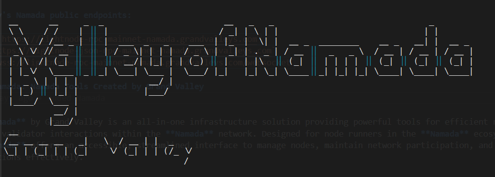
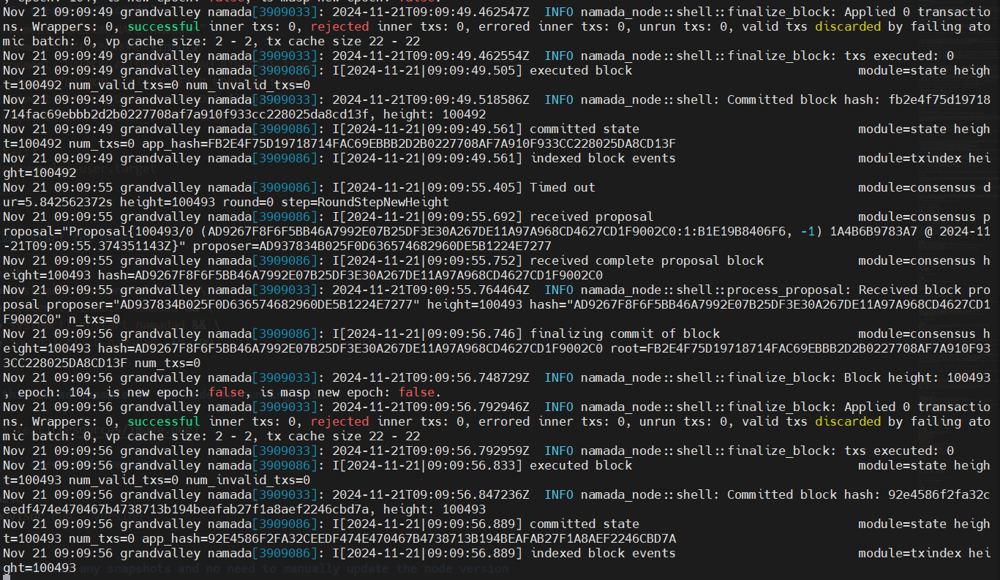

# Namada Mainnet Guide

`will always update`

<p align="center">
  
</p>

# Namada

## What is Namada?

Namada is a proof-of-stake Layer 1 (L1) for interchain asset-agnostic data protection. It natively interoperates with fast-finality chains via the Inter-Blockchain Communication (IBC) protocol. For data protection, Namada deploys an upgraded version of the multi-asset shielded pool (MASP) circuit that allows all assets (fungible and non-fungible) to share a common shielded set – this way, transferring a CryptoKitty is indistinguishable from transferring ETH, DAI, ATOM, OSMO, NAM (Namada's native asset), or any other asset on Namada. The MASP also enables shielded set rewards, a novel feature that funds data protection as a public good.

## Key Features

### Asset-Agnostic Shielded Transfers

- **Zcash-like Data Protection**: Transfer any fungible and non-fungible tokens with Zcash-like data protection, including native and non-native tokens.
- **zk-SNARKs**: Enabled by the deployment of novel zk-SNARKs.

### Shared Shielded Set

- **Indistinguishable Transfers**: A shielded transfer involving a Stargaze NFT is indistinguishable from an ATOM or NAM transfer.
- **Upgraded MASP**: The MASP, an upgraded version of Zcash's Sapling circuit, enables all assets to share the same shielded set, ensuring data protection guarantees are not fragmented among individual assets and are independent of the transaction volume of a particular asset.

### Fast ZKP Generation on Edge Devices

- **Vertical Integration**: Namada is vertically integrated, allowing users to interact at mainnet with the protocol and send shielded transfers via browser applications.

### Low Transaction Latency and Near-Zero Fees

- **Fast-Proof Generation**: Supports Visa-like speed with fast-proof generation and modern BFT consensus.
- **Scalability**: Namada scales via fractal instances, similar to Anoma.

### IBC Compatibility

- **Interoperability**: Interoperates with any fast-finality chain that is IBC compatible.

### Data Protection as a Public Good

- **Incentives**: The Namada protocol incentivizes users that hold shielded assets, thereby contributing to the shared shielded set, via the latest update of the MASP circuit that includes the novel Convert Circuit.
- **Public Good**: The shielded set in Namada is a non-exclusive and anti-rivalrous public good; the more people use shielded transfers, the better the data protection guarantees for each individual.

## Cubic Proof-of-Stake (CPoS)

### Innovations for Validators and Delegators

- **Cubic Slashing**: Penalties for safety faults in Namada are calculated following a cubic slashing algorithm, encouraging validators to deploy more diverse and uncorrelated setups.
- **Improved PoS Guarantees**: The cost of attacking Namada is quantifiable due to the automatic detection mechanism on which accounts contributed to the fault (validators, delegators, etc.).
- **Transaction Fees in Multiple Assets**: Fees can be paid in many tokens and can be updated via a governance vote.

## Namada Governance

### Formal On-Chain Mechanism

- **Stake-Weighted Voting**: Namada's on-chain governance protocol supports text-based proposals with stake-weighted voting.
- **Proposal Format**: Proposals in Namada use a similar format to BIP2.
- **Voting**: Anyone with NAM tokens can vote in governance, and delegators can overwrite their validators' votes.

### Public Goods Funding (PGF)

- **Retroactive and Continuous Funding**: Namada supports both retroactive and continuous public-goods funding.
- **Council**: Managed by a public-goods-funding council composed of trusted community members (elected by governance).
- **Disbursement**: Continuous funding is regularly distributed, while retroactive funding is distributed in lump-sum payments based on past work.
- **Veto Mechanism**: The community has a veto mechanism to check on council members' spending proposals.

For more detailed information, visit the [Namada Documentation](https://docs.namada.net/).

With Public Testnet, Namada's docs and code become public. Check them out below!

- [Namada Website](https://namada.net/)
- [Namada Twitter](https://twitter.com/namada)
- [Namada Discord](https://discord.gg/namada)
- [Namada Docs](https://docs.namada.net/)
- [Namada GitHub](https://github.com/anoma)

## Grand Valley's Namada public endpoints:

- cosmos rpc: `https://lightnode-rpc-mainnet-namada.grandvalleys.com`
- json-rpc: `https://lightnode-json-rpc-mainnet-namada.grandvalleys.com`
- cosmos ws: `wss://lightnode-rpc-mainnet-namada.grandvalleys.com/websocket`

## Valley Of Namada: Namada Tools Created by Grand Valley




**Valley of Namada** by Grand Valley is an all-in-one infrastructure solution providing powerful tools for efficient node management and validator interactions within the **Namada** network. Designed for node runners in the **Namada** ecosystem, **Valley of Namada** offers an accessible, streamlined interface to manage nodes, maintain network participation, and perform validator functions effectively.

### Installation

Run the following command to install Valley of Namada:

```bash
bash <(curl -s https://raw.githubusercontent.com/hubofvalley/Mainnet-Guides/main/Namada/resources/valleyofNamada.sh)
```

### Key Features of Valley of Namada

#### 1. Node Interactions

- **Deploy and Manage Validator Nodes**: Deploy new validator nodes or remove existing ones. **Important!** Always back up critical files (e.g., seed phrases, private keys, `priv_validator_key.json`) before deletion.
- **Node Control**: Start, stop, or restart validator nodes as needed.
- **Node Status**: Monitor the current operational status of the validator node.
- **Peer Management**: Add peers to enhance network stability and communication.
- **Logging**: Access unified logs for troubleshooting and monitoring.
- **Snapshot Application**: Quickly synchronize with the network by applying the latest snapshot, expediting node setup.

#### 2. Validator and Key Interactions

- **Validator Setup**: Create a validator to engage in network consensus and security.
- **Key Management**: Create and manage wallets, restore wallets, and create payment addresses.
- **Stake and Unstake Tokens**: Stake tokens to support network security or unstake them as required. Also, query validator public keys and account balances.
- **Redelegate Tokens**: Redelegate tokens to another validator.
- **Withdraw Unbonded Tokens**: Withdraw unbonded tokens from a validator.
- **Claim Rewards**: Claim rewards from a validator.
- **Transfer Tokens**: Transfer tokens between transparent and shielded accounts.

#### 3. Namada App Installation

- Install the Namada app (v0.45.1) for command-line transactions and network interactions without running a full node.

### Usage

To use the script, simply run it in a terminal. The script will display the logo and introduction, then prompt the user to press Enter to continue. After that, the main menu will be displayed, allowing the user to select various options for managing the Namada validator node.

### Menu Interface

The script provides a menu-driven interface that allows users to select different options for managing and interacting with the Namada validator node. The menu is organized into categories such as "Node Interactions," "Validator/Key Interactions," and "Install Namada App."

### Conclusion

**Valley of Namada** is a comprehensive tool designed to simplify the management and interaction with Namada validator nodes. It enables users to deploy, control, and monitor nodes, manage peers, access unified logs for troubleshooting, and apply snapshots for quick synchronization. The tool also facilitates validator setup, key management, staking and unstaking tokens, redelegation, unbonded token withdrawals, reward claims, and token transfers between transparent and shielded accounts. Additionally, it supports the installation of the Namada app (v0.45.1) for seamless command-line transactions and network interactions without requiring a full node. Featuring a user-friendly, menu-driven interface, **Valley of Namada** streamlines a wide range of tasks, making it an indispensable utility for both new and experienced Namada blockchain participants.

## Namada Validator Node Deployment Guide With Cosmovisor

### **System Requirements**

| Category  | Requirements                   |
| --------- | ------------------------------ |
| CPU       | 8 cores                        |
| RAM       | 64+ GB                         |
| Storage   | 1+ TB NVMe SSD                 |
| Bandwidth | 100 MBps for Download / Upload |

- guide's current binaries version: `v0.45.1 will automatically update to the latest version`
- service file name: `namadad.service`
- current chain : `namada-dryrun.abaaeaf7b78cb3ac`

## Validator Node Manual installation

### 1. Install dependencies for building from source

```bash
sudo apt update -y && sudo apt upgrade -y && \
sudo apt install -y curl git jq build-essential gcc unzip wget lz4 openssl \
libssl-dev pkg-config protobuf-compiler clang cmake llvm llvm-dev
```

### 2. install go

```bash
cd $HOME && ver="1.22.0" && \
wget "https://golang.org/dl/go$ver.linux-amd64.tar.gz" && \
sudo rm -rf /usr/local/go && sudo tar -C /usr/local -xzf "go$ver.linux-amd64.tar.gz" && \
rm "go$ver.linux-amd64.tar.gz" && \
echo 'export PATH=$PATH:/usr/local/go/bin:$HOME/go/bin' >> ~/.bash_profile && \
source ~/.bash_profile && go version
```

### 3. install cosmovisor

```bash
go install cosmossdk.io/tools/cosmovisor/cmd/cosmovisor@latest
```

### 4. install rust

```bash
curl --proto '=https' --tlsv1.2 -sSf https://sh.rustup.rs | sh
source $HOME/.cargo/env
rustc --version
```

### 5. install cometbft

```bash
cd $HOME
rm -rf cometbft
git clone https://github.com/cometbft/cometbft.git
cd cometbft
git checkout v0.37.11
make build
sudo cp $HOME/cometbft/build/cometbft /usr/local/bin/
cometbft version
```

### 5. set vars

ENTER YOUR MONIKER & YOUR PREFERRED PORT NUMBER

```bash
read -p "Enter your moniker: " ALIAS && echo "Current moniker: $ALIAS"
read -p "Enter your 2 digits custom port: (leave empty to use default: 26) " NAMADA_PORT && echo "Current port number: ${NAMADA_PORT:-26}"
read -p "Enter your wallet name: " WALLET && echo "Current wallet name: $WALLET"

echo "export WALLET="$WALLET"" >> $HOME/.bash_profile
echo "export MONIKER="$ALIAS"" >> $HOME/.bash_profile
echo "export NAMADA_CHAIN_ID="namada-dryrun.abaaeaf7b78cb3ac"" >> $HOME/.bash_profile
echo "export NAMADA_PORT="${NAMADA_PORT:-26}"" >> $HOME/.bash_profile
export NAMADA_NETWORK_CONFIGS_SERVER="https://testnet.namada-dryrun.tududes.com/configs"
source $HOME/.bash_profile
```

### 6. download binary

```bash
cd $HOME
wget https://github.com/anoma/namada/releases/download/v0.45.1/namada-v0.45.1-Linux-x86_64.tar.gz
tar -xvf namada-v0.45.1-Linux-x86_64.tar.gz
cd namada-v0.45.1-Linux-x86_64
mv namad* /usr/local/bin/
```

### 7. join the network as post-genesis validator

```bash
namadac utils join-network --chain-id $NAMADA_CHAIN_ID
peers=$(curl -sS https://lightnode-rpc-mainnet-namada.grandvalleys.com/net_info | jq -r '.result.peers[] | "\(.node_info.id)@\(.remote_ip):\(.node_info.listen_addr)"' | awk -F ':' '{print $1":"$(NF)}' | paste -sd, -)
echo $peers
sed -i -e "s|^persistent_peers *=.*|persistent_peers = \"$peers\"|" $HOME/.local/share/namada/namada-dryrun.abaaeaf7b78cb3ac/config.toml
```

### 8. set custom ports in config.toml file

```bash
sed -i.bak -e "/^\[p2p\]/,/^$/ s%laddr = \"tcp://0.0.0.0:26656\"%laddr = \"tcp://0.0.0.0:${NAMADA_PORT}656\"%g;
s%prometheus_listen_addr = \":26660\"%prometheus_listen_addr = \":${NAMADA_PORT}660\"%g;
s%proxy_app = \"tcp://127.0.0.1:26658\"%proxy_app = \"tcp://127.0.0.1:${NAMADA_PORT}658\"%g;
s%^laddr = \"tcp://127.0.0.1:26657\"%laddr = \"tcp://127.0.0.1:${NAMADA_PORT}657\"%g;
s%^pprof_laddr = \"localhost:26060\"%pprof_laddr = \"localhost:${NAMADA_PORT}060\"%g" $HOME/.local/share/namada/namada-dryrun.abaaeaf7b78cb3ac/config.toml
```

### 9. disable indexer (optional) (if u want to run a full node, skip this step)

```bash
sed -i -e "s/^indexer *=.*/indexer = \"null\"/" $HOME/.local/share/namada/namada-dryrun.abaaeaf7b78cb3ac/config.toml
```

### 10. initialize cosmovisor

```bash
echo "export DAEMON_NAME=namadan" >> $HOME/.bash_profile
echo "export DAEMON_HOME=$(find $HOME -type d -name "namada-dryrun.abaaeaf7b78cb3ac")" >> $HOME/.bash_profile
source $HOME/.bash_profile
cosmovisor init /usr/local/bin/namadan && \
mkdir -p $HOME/.local/share/namada/namada-dryrun.abaaeaf7b78cb3ac/cosmovisor/upgrades && \
mkdir -p $HOME/.local/share/namada/namada-dryrun.abaaeaf7b78cb3ac/cosmovisor/backup && \
mkdir -p $HOME/.local/share/namada/namada-dryrun.abaaeaf7b78cb3ac/data
```

### 11. define the path of cosmovisor

```bash
input1=$(which cosmovisor)
input2=$(find $HOME -type d -name "namada-dryrun.abaaeaf7b78cb3ac")
input3=$(find $HOME/.local/share/namada/namada-dryrun.abaaeaf7b78cb3ac/cosmovisor -type d -name "backup")
echo "export DAEMON_NAME=namadan" >> $HOME/.bash_profile
echo "export DAEMON_HOME=$input2" >> $HOME/.bash_profile
echo "export DAEMON_DATA_BACKUP_DIR=$(find $HOME/.local/share/namada/namada-dryrun.abaaeaf7b78cb3ac/cosmovisor -type d -name "backup")" >> $HOME/.bash_profile
source $HOME/.bash_profile
echo "input1. $input1"
echo "input2. $input2"
echo "input3. $input3"
```

### 12. create service file

```bash
sudo tee /etc/systemd/system/namadad.service > /dev/null <<EOF
[Unit]
Description=Cosmovisor Namada Mainnet Node
After=network.target

[Service]
User=$USER
Type=simple
WorkingDirectory=$HOME/.local/share/namada
ExecStart=${input1} run ledger run
StandardOutput=journal
StandardError=journal
Restart=on-failure
RestartSec=5
LimitNOFILE=65536
LimitNPROC=65536
Environment=CMT_LOG_LEVEL=p2p:debug,pex:info
Environment=NAMADA_CMT_STDOUT=true
Environment="DAEMON_NAME=namadan"
Environment="DAEMON_HOME=${input2}"
Environment="DAEMON_ALLOW_DOWNLOAD_BINARIES=false"
Environment="DAEMON_RESTART_AFTER_UPGRADE=true"
Environment="DAEMON_DATA_BACKUP_DIR=${input3}"
Environment="UNSAFE_SKIP_BACKUP=true"

[Install]
WantedBy=multi-user.target
EOF
```

### 20. start the node

```bash
sudo systemctl daemon-reload && \
sudo systemctl enable namadad && \
sudo systemctl restart namadad && \
sudo journalctl -u namadad -fn 100
```

### this is an example of the node is running well



### 21. check node version

```bash
namada --version
```

## you can use any snapshots and no need to manually update the node version
