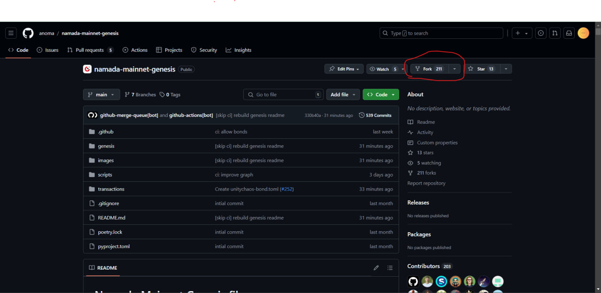
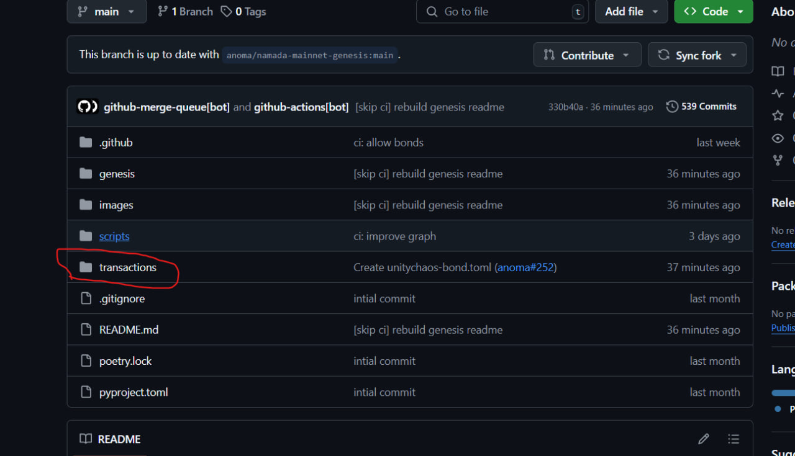
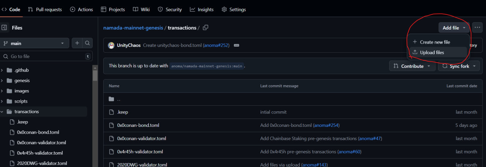
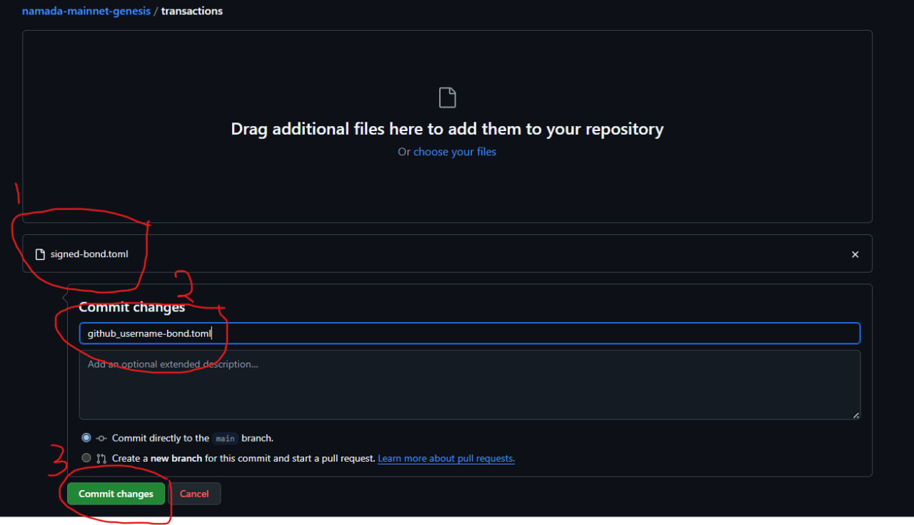
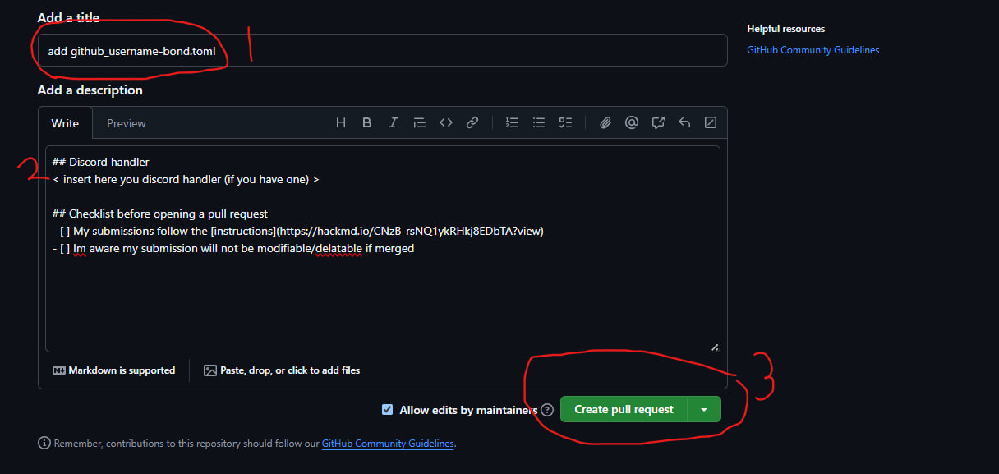

# Namada pre-genesis mainnet transactions guide

## Namada app deployment

### 1. Install dependencies for building from source

```bash
sudo apt update -y && sudo apt upgrade -y && \
sudo apt install -y curl git jq build-essential gcc unzip wget lz4 openssl \
libssl-dev pkg-config protobuf-compiler clang cmake llvm llvm-dev
```

### 2. install go

```bash
cd $HOME && ver="1.22.0" && \
wget "https://golang.org/dl/go$ver.linux-amd64.tar.gz" && \
sudo rm -rf /usr/local/go && sudo tar -C /usr/local -xzf "go$ver.linux-amd64.tar.gz" && \
rm "go$ver.linux-amd64.tar.gz" && \
echo 'export PATH=$PATH:/usr/local/go/bin:$HOME/go/bin' >> ~/.bash_profile && \
source ~/.bash_profile && go version
```

### 3. install rust

```bash
curl --proto '=https' --tlsv1.2 -sSf https://sh.rustup.rs | sh
source $HOME/.cargo/env
rustc --version
```

### 4. download and build cometBFT

```bash
cd $HOME
git clone -b v0.37.9 https://github.com/cometbft/cometbft.git
cd $HOME/cometbft
git stash
git fetch --all --tags
make build
sudo cp $HOME/cometbft/build/cometbft /usr/local/bin/
```

### 5. download and build Namada binary

```bash
cd $HOME
git clone -b v0.43.0 https://github.com/anoma/namada
cd namada
wget https://github.com/anoma/namada/releases/download/v0.43.0/namada-v0.43.0-Linux-x86_64.tar.gz
tar -xvf namada-v0.43.0-Linux-x86_64.tar.gz
rm namada-v0.43.0-Linux-x86_64.tar.gz
cd namada-v0.43.0-Linux-x86_64
sudo mv namad* /usr/local/bin/
namada --version
```

### 6. import wallet

#### enter your wallet name

```bash
echo "export ALIAS="<wallet-name>"" >> $HOME/.bash_profile
source ~/.bash_profile
```

#### import from mnemonic

```bash
namadaw --pre-genesis derive --alias $ALIAS
```

#### import from private key

```bash
namadaw --pre-genesis add --alias $ALIAS --value <your-private-key>
```

### 7. display your addresses store public key as a variable

```bash
namadaw --pre-genesis list
output=$(namadaw --pre-genesis list)
PUB_KEY=$(echo "$output" | awk '/Public key:/ {print $NF}')
```

## Pre-genesis bond transaction (PHASE 1 - stage 2)

### 1. create namada-pre-genesis folder

```bash
mkdir -p $HOME/namada-pre-genesis
```

### 2. create the unsign bond pre-genesis transaction

Input the `amount` of NAM you wannna delegate

```bash
cd $HOME/namada-pre-genesis
namadac utils genesis-bond \
  --source $PUB_KEY \
  --validator tnam1qyplu8gruqmmvwp7x7kd92m6x4xpyce265fa05r6 \
  --amount <amount> \
  --path ~/namada-pre-genesis/bond.toml
```

### 3. sign the transaction file

```bash
namadac utils sign-genesis-txs \
  --path bond.toml \
  --output signed-bond.toml
```

### 4. Make a pull request

#### Make a Pull Request to the [mainnet-genesis repo](https://github.com/anoma/namada-mainnet-genesis) by doing the following:

#### a) rename the signed-bond.toml file to match the Github username of the account you'll be submitting from; ie. `github_username-bond.toml`

#### b) clone the repo and place your `github_username-bond.toml` in the transactions/ folder

#### c) create a new Pull Request with the name "Add {github_username}-bond.toml"











