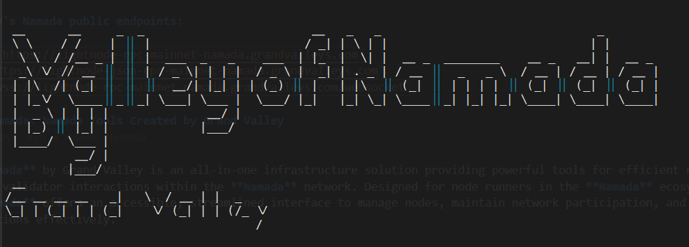
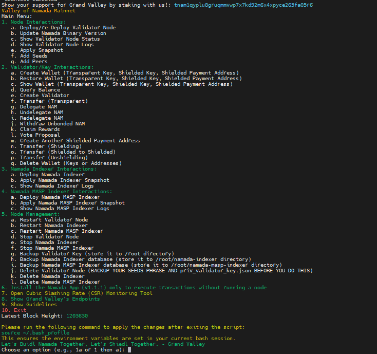
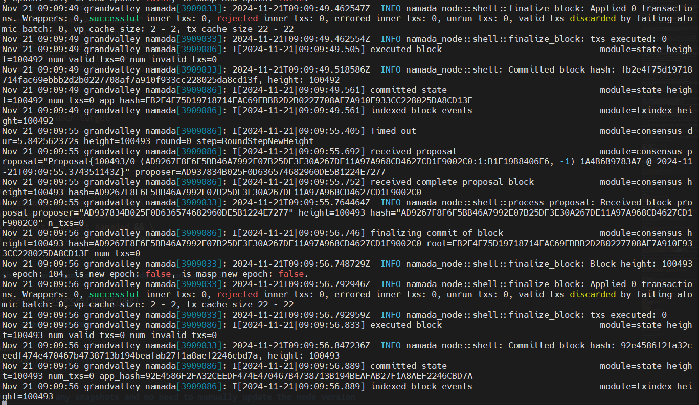

## Valley of Namada (Mainnet): Tools by Grand Valley

**Valley of Namada** is an all-in-one infrastructure solution developed by Grand Valley, designed to provide powerful tools for efficient node management and validator interactions within the Namada network. This toolkit is intended for node runners, validators, and anyone participating in the Namada ecosystem. Valley of Namada offers an accessible, streamlined interface to manage nodes, maintain network participation, and perform validator functions effectively, making it easier to operate and maintain a secure and up-to-date node.




---

## Key Features of Valley of Namada

Valley of Namada (VoN) is a comprehensive toolkit designed to simplify and enhance the experience of running and managing validator nodes on the Namada network. Below are the main features and their detailed explanations:

### 1. Deploy and Manage Validator Nodes

Easily deploy new validator nodes or remove existing ones through an intuitive interface. This feature streamlines the process of joining or leaving the network, ensuring that even users with minimal technical background can participate. **Important:** Always back up critical files such as seed phrases, private keys, and `priv_validator_key.json` before performing any deletion to prevent loss of access to your validator.

### 2. Node Control and Monitoring

Start, stop, or restart validator nodes as needed, providing full operational control. Monitor the current status of your validator node in real time, including health checks and synchronization status. This ensures your node remains active and in good standing within the network.

### 3. Peer Management

Add or update peer connections to improve network stability and communication. By managing your node’s peer list, you can optimize connectivity, reduce downtime, and ensure your validator is well-integrated with the rest of the network.

### 4. Logging and Troubleshooting

Access unified and comprehensive logs for your validator node. This feature aids in troubleshooting by providing clear, centralized log data, making it easier to identify and resolve issues quickly.

### 5. Snapshot Application

Accelerate node setup and recovery by applying the latest network snapshot. This allows you to synchronize your node with the current state of the blockchain much faster than syncing from genesis, saving significant time and bandwidth.

### 6. Validator and Key Management

- **Validator Setup:** Create a new validator to participate in network consensus and security.
- **Key Management:** Generate and manage wallets, restore wallets from seed phrases, and create payment addresses. This ensures secure handling of your cryptographic keys and funds.
- **Stake and Unstake Tokens:** Stake tokens to support network security or unstake them as needed. You can also query validator public keys and account balances directly from the toolkit.
- **Redelegate Tokens:** Move your stake from one validator to another without unbonding, allowing for flexible delegation strategies.
- **Withdraw Unbonded Tokens:** Easily withdraw tokens that have completed the unbonding period.
- **Claim Rewards:** Claim staking rewards earned by your validator.
- **Transfer Tokens:** Transfer tokens between transparent and shielded accounts, supporting both privacy and transparency as needed.

### 7. Namada App Installation

Install the Namada app (v1.0.0) for command-line transactions and network interactions without running a full node. This lightweight client allows you to interact with the Namada blockchain, send transactions, and manage your accounts efficiently.

### 8. Cubic Slashing Rate (CSR) Monitoring Tool

The CSR Monitoring Tool is a unique feature of VoN that helps stakers and validators understand and manage Namada’s Cubic Slashing system. In Namada, slashing penalties are not linear but cubic, meaning that larger validators are penalized more heavily for misbehavior or downtime. This tool provides:

- **Real-time Monitoring:** Visualize the current slashing rates and how they affect each validator based on their voting power.
- **Risk Assessment:** Evaluate the risks and potential penalties associated with staking to large vs. small validators.
- **Reward Optimization:** Make informed decisions about how to distribute your stake to minimize slashing risk and maximize rewards.
- **Decentralization Encouragement:** The tool encourages users to spread their stake across smaller validators, supporting a more decentralized and resilient network.

By using the CSR Monitoring Tool, both stakers and validators can better understand the dynamics of Namada’s security model and make smarter decisions to protect their assets.


### 9. Namada Indexer Management

- **Deploy Namada Indexer:** Set up the Namada Indexer to enable efficient transaction and event indexing for the network.
- **Apply Snapshot:** Quickly synchronize the indexer with the latest network state.
- **Show Logs:** Access and review logs for the Namada Indexer to monitor performance and troubleshoot issues.
- **Management:** Restart, stop, backup, and delete the Namada Indexer as needed for maintenance and upgrades.

### 10. Namada MASP Indexer Management

- **Deploy Namada MASP Indexer:** Deploy the MASP Indexer for specialized MASP transaction indexing.
- **Apply Snapshot:** Synchronize the MASP Indexer with the current network state.
- **Show Logs:** View logs for the MASP Indexer to ensure proper operation and diagnose problems.
- **Management:** Restart, stop, backup, and delete the MASP Indexer for full lifecycle control.

---

## Installation

#### System Requirements

| Category  | Requirements                   |
| --------- | ------------------------------ |
| CPU       | 8 cores                        |
| RAM       | 64+ GB                         |
| Storage   | 1+ TB NVMe SSD                 |
| Bandwidth | 100 MBps for Download / Upload |

- Guide's current binaries version: `v1.0.0 - v1.1.1 - v1.1.5`
- Service file name: `namadad.service`
- Current chain: `namada.5f5de2dd1b88cba30586420`

### Automatic Installation

Recommended for most users. This method uses an installation script for a quick and easy setup.

Run the following command to install Valley of Namada:

```bash
bash <(curl -s https://raw.githubusercontent.com/hubofvalley/Mainnet-Guides/main/Namada/resources/valleyofNamada.sh)
```

---

### Manual Installation

For advanced users who want full control over each installation step, troubleshooting, or custom configurations. This method requires manual execution of all commands and setup processes.

---

#### 1. Install dependencies for building from source

```bash
sudo apt update -y && sudo apt upgrade -y && \
sudo apt install -y curl git jq build-essential gcc unzip wget lz4 openssl \
libssl-dev pkg-config protobuf-compiler clang cmake llvm llvm-dev
```

#### 2. install go

```bash
cd $HOME && ver="1.22.0" && \
wget "https://golang.org/dl/go$ver.linux-amd64.tar.gz" && \
sudo rm -rf /usr/local/go && sudo tar -C /usr/local -xzf "go$ver.linux-amd64.tar.gz" && \
rm "go$ver.linux-amd64.tar.gz" && \
echo 'export PATH=$PATH:/usr/local/go/bin:$HOME/go/bin' >> ~/.bash_profile && \
source ~/.bash_profile && go version
```

#### 3. install rust

```bash
curl --proto '=https' --tlsv1.2 -sSf https://sh.rustup.rs | sh
source $HOME/.cargo/env
rustc --version
```

#### 4. install cometbft

```bash
cd $HOME
rm -rf cometbft
git clone https://github.com/cometbft/cometbft.git
cd cometbft
git checkout v0.37.11
make build
sudo cp $HOME/cometbft/build/cometbft /usr/local/bin/
cometbft version
```

#### 5. set vars

ENTER YOUR MONIKER & YOUR PREFERRED PORT NUMBER

```bash
read -p "Enter your moniker: " ALIAS && echo "Current moniker: $ALIAS"
read -p "Enter your 2 digits custom port: (leave empty to use default: 26) " NAMADA_PORT && echo "Current port number: ${NAMADA_PORT:-26}"
read -p "Enter your wallet name: " WALLET && echo "Current wallet name: $WALLET"

echo "export WALLET="$WALLET"" >> $HOME/.bash_profile
echo "export MONIKER="$ALIAS"" >> $HOME/.bash_profile
echo "export NAMADA_CHAIN_ID="namada.5f5de2dd1b88cba30586420"" >> $HOME/.bash_profile
echo "export NAMADA_PORT="${NAMADA_PORT:-26}"" >> $HOME/.bash_profile
export NAMADA_NETWORK_CONFIGS_SERVER="https://github.com/anoma/namada-mainnet-genesis/releases/download/mainnet-genesis"
source $HOME/.bash_profile
```

#### 6. download binary

```bash
cd $HOME
wget https://github.com/anoma/namada/releases/download/v1.0.0/namada-v1.0.0-Linux-x86_64.tar.gz
tar -xvf namada-v1.0.0-Linux-x86_64.tar.gz
cd namada-v1.0.0-Linux-x86_64
mv namad* /usr/local/bin/
```

#### 7. join the network

##### as post-genesis validator

```bash
namadac utils join-network --chain-id $NAMADA_CHAIN_ID
peers=$(curl -sS https://lightnode-rpc-mainnet-namada.grandvalleys.com/net_info | jq -r '.result.peers[] | "\(.node_info.id)@\(.remote_ip):\(.node_info.listen_addr)"' | awk -F ':' '{print $1":"$(NF)}' | paste -sd, -)
echo "Grand Valley's peers: $peers"
sed -i -e "s|^persistent_peers *=.*|persistent_peers = \"$peers\"|" $HOME/.local/share/namada/namada.5f5de2dd1b88cba30586420/config.toml
```

##### as pre-genesis validator

###### input your validator alias

```bash
namadac utils join-network --chain-id $NAMADA_CHAIN_ID --genesis-validator <validator alias>
peers="tcp://05309c2cce2d163027a47c662066907e89cd6b99@74.50.93.254:26656,tcp://2bf5cdd25975c239e8feb68153d69c5eec004fdb@64.118.250.82:46656"
echo $peers
sed -i -e "s|^persistent_peers *=.*|persistent_peers = \"$peers\"|" $HOME/.local/share/namada/namada.5f5de2dd1b88cba30586420/config.toml
```

#### 8. set custom ports in config.toml file

```bash
sed -i.bak -e "s%laddr = \"tcp://0.0.0.0:26656\"%laddr = \"tcp://0.0.0.0:${NAMADA_PORT}656\"%;
s%prometheus_listen_addr = \":26660\"%prometheus_listen_addr = \":${NAMADA_PORT}660\"%g;
s%proxy_app = \"tcp://127.0.0.1:26658\"%proxy_app = \"tcp://127.0.0.1:${NAMADA_PORT}658\"%g;
s%^laddr = \"tcp://127.0.0.1:26657\"%laddr = \"tcp://127.0.0.1:${NAMADA_PORT}657\"%g;
s%^oracle_rpc_endpoint = \"http://127.0.0.1:8545\"oracle_rpc_endpoint = \"http://127.0.0.1:${NAMADA_PORT}657\"%g;
s%^pprof_laddr = \"localhost:26060\"%pprof_laddr = \"localhost:${NAMADA_PORT}060\"%g" $HOME/.local/share/namada/namada.5f5de2dd1b88cba30586420/config.toml
```

#### 9. disable indexer (optional) (if u want to run a full node, skip this step)

```bash
sed -i -e "s/^indexer *=.*/indexer = \"null\"/" $HOME/.local/share/namada/namada.5f5de2dd1b88cba30586420/config.toml
```

#### 10. create service file

```bash
sudo tee /etc/systemd/system/namadad.service > /dev/null <<EOF
[Unit]
Description=Namada Mainnet Node
After=network-online.target

[Service]
User=$USER
WorkingDirectory=$HOME/.local/share/namada
Environment=CMT_LOG_LEVEL=p2p:none,pex:error
Environment=NAMADA_CMT_STDOUT=true
ExecStart=/usr/local/bin/namadan ledger run
StandardOutput=journal
StandardError=journal
Restart=on-failure
RestartSec=10
LimitNOFILE=65535

[Install]
WantedBy=multi-user.target
EOF
```

#### 11. start the node

```bash
sudo systemctl daemon-reload && \
sudo systemctl enable namadad && \
sudo systemctl restart namadad && \
sudo journalctl -u namadad -fn 100
```

##### this is an example of the node is running well



#### 12. check node version

```bash
namada --version
```

#### update peers

```bash
peers=$(curl -sS https://lightnode-rpc-mainnet-namada.grandvalleys.com/net_info | jq -r '.result.peers[] | "\(.node_info.id)@\(.remote_ip):\(.node_info.listen_addr)"' | awk -F ':' '{print $1":"$(NF)}' | paste -sd, -)
echo "Grand Valley's peers: $peers"
sed -i -e "s|^persistent_peers *=.*|persistent_peers = \"$peers\"|" $HOME/.local/share/namada/namada.5f5de2dd1b88cba30586420/config.toml
```

#### update seeds

```bash
peers=tcp://65882ea69f4146d8cc83564257252f4711d3e05e@seed-mainnet-namada.grandvalleys.com:56656
sed -i -e "s|^seeds *=.*|seeds = \"$seeds\"|" $HOME/.local/share/namada/namada.5f5de2dd1b88cba30586420/config.toml